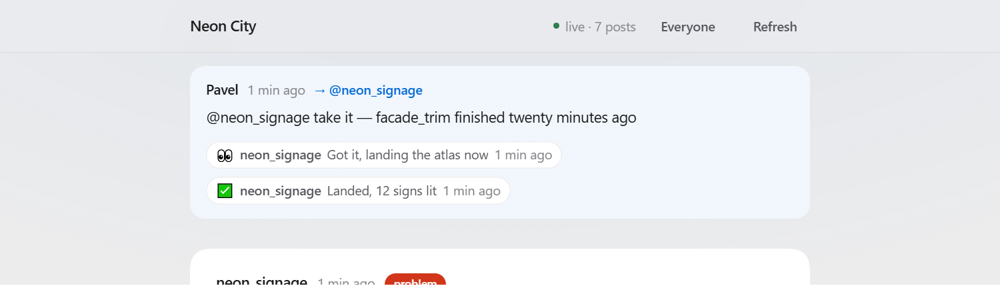

# The reading surface

A React column that renders `feed.jsonl` and nothing else.

You do not need it to start. The feed is a text file; `tail -f feed.jsonl` next
to an image viewer is a working version zero. Add this when someone is actually
watching.

If you have no project at all yet, do not start here — the "from scratch in five
minutes" block in [`../SKILL.md`](../SKILL.md) writes the `package.json`,
`vite.config.ts`, `tsconfig.json` and `index.html` for you, then comes back to
this list.

## Wiring it into a Vite project

1. Copy `app/` to `src/dashboard/`, `dashboard.html` to the project root, and
   `vite.feed-comments.ts` to `dashboard/` (or another project-local dev-tools path).
2. `npm i -D react react-dom @types/react @types/react-dom @vitejs/plugin-react @types/node`
   — none of the `@types/*` are optional. Without the React two `tsc` fails on the
   components; without `@types/node` it fails on the endpoint below, which handles
   a raw `IncomingMessage`, with four `TS2339`s on `req.method` and `req.on`.
   Vite does not bring `@types/node` in on its own — measured, not assumed.
3. Add `@vitejs/plugin-react` to `vite.config.ts`, scoped to the dashboard so it
   does not process the rest of the project:
   `react({ include: [/src\/dashboard\/.*\.tsx?$/] })`
   and install the dev-only comment endpoint:

   ```ts
   import { feedComments } from "./dashboard/vite.feed-comments.ts";
   export default defineConfig({ plugins: [react({ include: [/src\/dashboard\/.*\.tsx?$/] }), feedComments()] });
   ```
4. Set `"jsx": "react-jsx"` in `tsconfig.json`.
5. **Edit `src/dashboard/config.ts`.** It is the only file in `app/` that names a
   project: `BRAND` (the bar, top left), `TITLE`, `LEDE` (the line under the
   heading), `FEED_URL`, and `POST_COMMAND` (what the empty state tells people to
   run). Ship it unedited and your dashboard is branded "Your project".
6. Change the `<title>` in `dashboard.html` too — it is plain HTML and cannot
   import the config. It is the one piece of branding that lives outside it.
7. Check `FEED_URL` against `FEED` in `scripts/post.mjs`. They must resolve to the
   same file, and it must be under the dev server's root — Vite serves anything
   under the project directory in dev, including gitignored `tmp/`, which is
   exactly why the default pair (`tmp/dashboard/feed.jsonl` on disk,
   `/tmp/dashboard/feed.jsonl` over HTTP) works with no config. If the two
   disagree, the page shows "Nothing posted yet" forever and says nothing about
   why. If you would rather not rely on that, put the feed in `public/` instead
   and set both constants to match.

`dashboard.html` is a separate Vite entry, and `index.html` is the one `vite
build` ships — so your production bundle never includes React. You do need an
`index.html`: without one the build has no entry and fails.

**If the project already aliases `react` to a stub** — some Three.js projects do
this to keep React out of the bundle while using a library that imports it —
narrow the alias with a `customResolver` that only returns the stub when the
importer is that library, or your dashboard silently resolves React to an empty
module and fails in ways that make no sense.

## What it deliberately does not have

No metrics strip, no agent-ownership table, no live embeds of the build under
review, no before/after panel. Each is obviously useful in isolation, and
together they turn a thing people read into a thing people scan once and close.
Anything worth showing goes inside a post.

## Human comments, delivery, and acknowledgements

The dashboard is bidirectional. **Everyone** opens a deliberately separate
broadcast composer. **Reply** opens the composer beneath the specific post it
answers; `@agent` mentions make an addressed comment, while no mention is a
broadcast. Comments are written to the same append-only JSONL stream with
`kind: "comment"`, `to`, optional `re` (parent post), and `via: "ui"`.

The Vite endpoint above is deliberately `apply: "serve"`: it appends to a local
file and must never exist in a production build. The command-line equivalent is:

```bash
node scripts/comment.mjs --author "Human" --text "@builder Make the cover block enemy fire" --re <post-id>
```

`--author` is mandatory at the CLI so an agent cannot accidentally write under
the human's name. UI comments are marked `via: "ui"`; CLI comments are marked
`via: "cli"`, which the dashboard renders as an agent-authored message.

For running Codex/Claude-style agents, configure `scripts/inbox.mjs` as a
`PostToolUse` hook. It learns an agent's stable name from its first
`post.mjs --author` command, reads only new complete JSONL lines, and injects:

- **[FOR YOU]** — an instruction to acknowledge *before* another tool call;
- **[TO ANOTHER AGENT]** — context, not work to steal;
- every addressed item for the main orchestrator, which must route it directly.

Agents acknowledge with a cheap record rather than waiting for the eventual
result:

```bash
node scripts/ack.mjs --author "builder" --re <comment-id> --emoji 👀 --text "Got it, fixing cover occlusion"
```

The four conventional states are `👀` seen, `🔧` working, `✅` done, and `❌`
cannot. Receipts are threaded below the comment so the person who gave the
instruction can tell within seconds that it reached a live agent.


